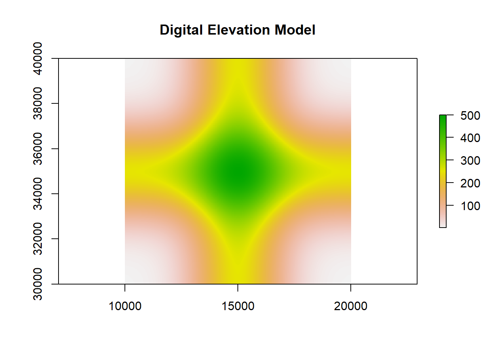
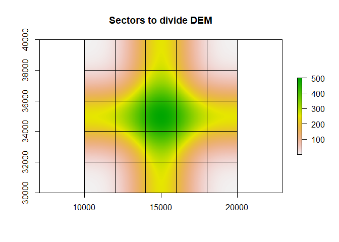
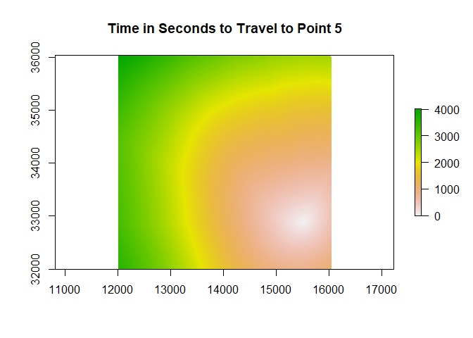
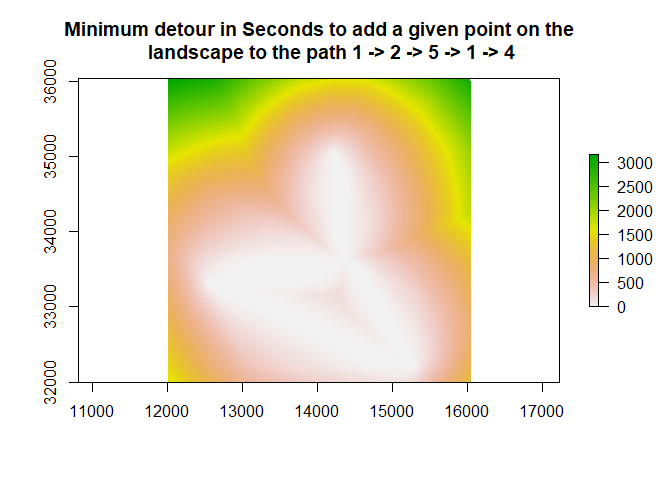
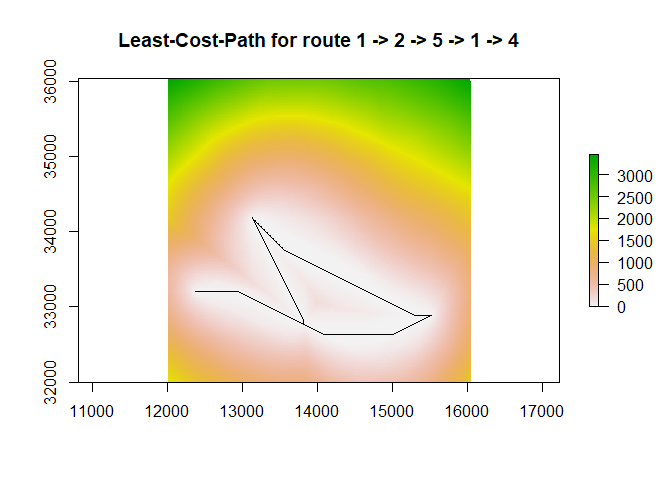

<!-- README.md is generated from README.Rmd. Please edit that file -->

# lbmech

<!-- badges: start -->
<!-- badges: end -->

`lbmech` is a geospatial package for `R` to calculate time- and
energy-based costs-of-travel for humans and animals moving across the
landscape. While providing a similar functionality to the package
`gdistance`, `lbmech` stores data and performs all linear algebra using
the `data.table` package allowing for in-place modification of objects
greatly increasing processing speed. `lbmech` also modularizes important
aspects of the cost-distance workflow allowing for
computationally-intensive and otherwise prohibitively-large operations
to take place. Moreover, unlike similar tools such as `package` for `R`,
`lbmech` allows for the estimation of various types of energetic losses
(due to kinematic locomotion, work against gravity, basal metabolic
processes) instead of simply the total energetic or metabolic
expenditure.

The example provided in this README provides a detailed guide employing
the examples included in the individual function documentation and
generating all data from scratch. For applied/real-world examples,
please see the provided vignettes. For most purposes, only five or six
function calls to the package are necessary. A ‘quick start’ guide
summarizing the README example in as few function calls as possible is
provided at the end of this file.

## Installation

You can install the development version from
[GitHub](https://github.com/) with:

    # install.packages("devtools")
    devtools::install_github("andresgmejiar/lbmech")

## Example Workflow

    library(lbmech)
    # Set random seed for reproducibility's sake
    set.seed(5574741)

### Part 1: Topographic data sources

The first step in a typical `lbmech` workflow is defining the digital
elevation model (DEM) to define as the topographic data source. This may
be provided in one of two ways:

1.  A RasterLayer object representing the digital elevation model for
    the region-of-interest
    -   In order to ensure that there is a stable file path to the
        source DEM throughout the workflow, the raster must have been
        ‘read in’ using the `raster` function without having been
        further modified. If additional modifications are necessary, use
        the `writeRaster` function to save it to the disk first before
        re-reading it in using `raster`. For example:

<!-- -->

    # Generate a DEM
    n <- 5
    dem <- expand.grid(list(x = 1:(n * 100),
                            y = 1:(n * 100))) / 100
    dem <- as.data.table(dem)
    dem[, z := 250 * exp(-(x - n/2)^2) + 
          250 * exp(-(y - n/2)^2)]
    dem <- rasterFromXYZ(dem)
    extent(dem) <- c(10000, 20000, 30000, 40000)
    crs(dem) <- "+proj=lcc +lat_1=48 +lat_2=33 +lon_0=-100 +datum=WGS84"

    # Export it so it doesn't just exist on the memory
    dir <- tempdir()
    writeRaster(dem, paste0(dir,"/DEM.tif"),format="GTiff",overwrite=TRUE)

    # Import raster
    dem <- raster(paste0(dir,"/DEM.tif"))

    plot(dem, main = "Digital Elevation Model")

1.  A SpatialPolygonsDataFrame object whose individual polygons
    represent sectors with unique DEM sources stored as a file path or
    URL in the data frame object.
    -   As of the most recent version, `lbmech` supports file types
        readible by `rgdal` and `raster`, as well as such files
        compressed in `gz` and `zip` files–although the latter is likely
        to fail in Unix systems.

Even if you have already downloaded or imported a raster to use as a
topographic data source as in case one above, most of the functions will
expect a SpatialPolygonsDataFrame object in the form of case two. You
can make this using the `makeGrid` function:

    grid <- makeGrid(dem = dem, nx = n, ny = n)

    plot(dem, main = "Sectors to divide DEM")
    plot(grid,add=TRUE)

`lbmech` is specifically designed to deal with **large** regions that
would be prohibitive to analyze if the data is stored exclusively within
the memory. To deal with this issue, `lbmech` will crop any input raster
into an `nx` by `ny` grid and save the sector in its own `gz` file for
case 1. In both cases—to save memory and computational time—sectors are
only cropped or downloaded on an as-needed basis. You can use the
`whichTiles` and `getMap` functions to identify which tile(s) might be
needed, and download or crop any such tiles that haven’t been prepared:

    # Generate five random points that fall within the grid
    points <- data.table(x = runif(5, extent(dem)[1], extent(dem)[2]),
                         y = runif(5, extent(dem)[3], extent(dem)[4]))
                   
                               
    # Run whichTiles and getMap to prepare appropriate sector files
    tile_list <- whichTiles(region = points, polys = grid) 
    print(tile_list)
    #> [1] "SECTOR_17" "SECTOR_5"  "SECTOR_1"  "SECTOR_10"

    getMap(tiles = tile_list, polys = grid, dir = dir)
    print(list.files(dir,recursive=TRUE, pattern = ".gz$"))
    #>  [1] "Elevations/SECTOR_1.gz"      "Elevations/SECTOR_10.gz"     "Elevations/SECTOR_11.gz"    
    #>  [4] "Elevations/SECTOR_12.gz"     "Elevations/SECTOR_13.gz"     "Elevations/SECTOR_14.gz"    
    #>  [7] "Elevations/SECTOR_15.gz"     "Elevations/SECTOR_16.gz"     "Elevations/SECTOR_17.gz"    
    #> [10] "Elevations/SECTOR_18.gz"     "Elevations/SECTOR_19.gz"     "Elevations/SECTOR_2.gz"     
    #> [13] "Elevations/SECTOR_20.gz"     "Elevations/SECTOR_21.gz"     "Elevations/SECTOR_22.gz"    
    #> [16] "Elevations/SECTOR_23.gz"     "Elevations/SECTOR_24.gz"     "Elevations/SECTOR_25.gz"    
    #> [19] "Elevations/SECTOR_3.gz"      "Elevations/SECTOR_4.gz"      "Elevations/SECTOR_5.gz"     
    #> [22] "Elevations/SECTOR_6.gz"      "Elevations/SECTOR_7.gz"      "Elevations/SECTOR_8.gz"     
    #> [25] "Elevations/SECTOR_9.gz"      "Tensors/SECTOR_12_Tensor.gz" "Tensors/SECTOR_13_Tensor.gz"
    #> [28] "Tensors/SECTOR_7_Tensor.gz"  "Tensors/SECTOR_8_Tensor.gz"

By far the most computationally intensive part of the workflow is the
first transformation of the topographic data. To calculate the
distances, we will need to convert the data from a a matrix of locations
(a raster) with an associated attribute (elevation) to a list of
possible movements between locations (all raster cells and their
neighbors) and associated attribute (difference in elevation). These are
stored as `gz` files in a folder named `'Tensors'` in the workspace
directory and will be later read into the memory as required to avoid
having to re-calculate them every time they are needed:

    # Select all tiles that exist between x = (12000,16000) and y = (32000,36000)
    tiles <- extent(c(12000,16000,32000,36000))
    tiles <- as(tiles,"SpatialPolygons")
    crs(tiles) <- crs(grid)
    tiles <- whichTiles(region = tiles, polys = grid)

    makeWorld(tiles = tiles, polys = grid, cut_slope = 0.5, z_fix = dem, dir = dir)

`makeWorld` internally calls `getMap` so you do not need to prepare the
data beforehand. A note about the parameters. The `cut_slope` is the
magnitude of the dimensionless slope beyond which movement is not
possible.

`z_fix` merits special attention since its consistency will be required
for most of the later functions in the workflow. `lbmech` allows for
sector-defining grids pointing to DEM sources in different coordinate
reference systems, spatial resolutions, and grid origins. However, the
package requires a ‘master’ raster be designated that will define the
projection, spatial resolution, and grid origin to be used in the
analyses. All data will be projected to these ‘fixed’ parameters. If
your sector-defining grid points to a single raster such as the output
of the `makeGrid` function, you can simply use the original DEM as the
`z_fix` parameter throughout. If the grid is custom or comes from a
third party, it is useful to designate a raster from within the dataset
as the master if the spatial resolution matches the desired unit of
analysis. If not, you can make an appropriate `z_fix` using the `fix_z`
function:

    z_fix <- fix_z(res = res(dem)[1],      # Desired resolution
                   crs = crs(dem),         # Desired projection
                   dx  = origin(dem)[1],   # Desired horizontal offset
                   dy  = origin(dem)[2])   # Desired vertical offset

### Part 2: Velocity data sources

The fundamental assumption behind the least-cost calculations is that
humans and animals tend to prefer to walk at predictable speeds at a
given slope. The maximum speed is generally achieved at one particular
slope, and speed would tend to decrease exponentially as the distance to
this ideal slope increases. Mathematically, this is described by
Tobler’s Hiking function
*d*ℓ/*d**t* = *v**m**a**x**e* − *k*|*d**z*/*d*ℓ − *α*|,
where ℓ is horizontal displacement, *t* time, *d*ℓ/*d**t* horizontal
speed, *v**m**a**x* the maximum walking speed, *d**z*/*d*ℓ
the change in elevation versus the change in horizontal distance
(dimensionless slope, or arctan *θ* where *θ* is the slope in degrees or
radians), *α* the ideal slope of maximum walking speed, and *k* a
parameter controling how sensitive changes in speed are to changes in
slope. Canonical applications of this function to humans set
*v**m**a**x* = 1.5 m/s, *k* = 3.5, and
*α* =  − 0.05 = tan ( − 2.83∘).

`lbmech` provides the getVelocity function by which these parameters can
be estimated from locational data for different species. Data should be
structured such that there is a column with x coordinates, a column with
y coordinates, a column with changes in time, and a column with a
trajectory id. Note that all values must be in meters, and the `'x'` and
`'y'` coordinates in a projected coordinate system. If those columns are
named anything other than `'x'`, `'y'`, ‘`dt`’, and `'id'`, the column
names need to be declared explicitly. Elevational data is provided as
the `z` parameter. This can be either a column with elevations—such as
those recorded by a GPS unit—a RasterLayer representing the DEM for that
region, or a SpatialPolygonsDataFrame like the output of the `makeGrid`
function:

    # Generate dummy GPS data
    # 10,000 observations falling within the extent of the generted DEM
    # taken at an interval of 120 seconds between observations
    # and of 10 different individuals (1000 per individual)
    data <- data.table(x = runif(10000,extent(dem)[1],extent(dem)[2]),
                       y = runif(10000,extent(dem)[3],extent(dem)[4]),
                       dt = 120,
                       ID = rep(1:10,each=1000))

    velocity <- getVelocity(data = data, z = grid, dir = dir)

So what happened? `getVelocity` called `whichTiles` and `getMap` to
identify which tiles were needed to get the elevation for the points we
generated in `data`. It then cropped and saved each tile in a folder
named `'Elevations'` in the `dir`. Afterwards, it extracted the
elevation for each `data` point, and performed a nonlinear quantile
regression to get the appropriate parameters.

The output object is a list. Since this was calculated based on random
data, the calculated parameters here are meaningless but let’s have a
look at the structure anyways: $model Nonlinear quantile regression
model: dl\_dt ~ v\_max \* exp(-k \* abs(dz\_dl - alpha)) data: data tau:
0.995 deviance: 428573.2 k alpha 0.7260741 50.2094994

$vmax \[1\] 90.81751

$alpha \[1\] 50.2095

$k \[1\] 0.7260741

$tau\_vmax \[1\] 0.995

$tau\_nlrq \[1\] 0.95

$data ID x y z dt dx dy dz dl dl\_dt dz\_dl 1: 1 14184.43 37082.75
296.04593 120 NA NA NA NA NA NA 2: 1 13726.24 35062.09 417.70062 120
-458.1817 -2020.6651 121.65469 2071.960 17.26633 0.058714792 3: 1
11211.38 31641.73 22.39640 120 -2514.8615 -3420.3624 -395.30422 4245.398
35.37832 -0.093113575 4: 1 16539.87 30648.36 140.43419 120 5328.4904
-993.3627 118.03779 5420.293 45.16911 0.021777011 5: 1 19063.24 34536.91
241.01436 120 2523.3705 3888.5521 100.58017 4635.541 38.62950
0.021697614 —  
9996: 10 16832.04 33654.95 266.82159 120 4605.6630 -4322.2371 202.44404
6316.159 52.63466 0.032051764 9997: 10 13210.97 38417.22 126.65144 120
-3621.0667 4762.2646 -140.17016 5982.582 49.85485 -0.023429709 9998: 10
18523.71 37188.86 85.44712 120 5312.7413 -1228.3575 -41.20432 5452.897
45.44081 -0.007556409 9999: 10 16082.61 34620.62 426.77194 120
-2441.1016 -2568.2359 341.32482 3543.277 29.52731 0.096330265 10000: 10
11045.88 38322.00 20.53027 120 -5036.7365 3701.3801 -406.24168 6250.514
52.08762 -0.064993319 The velocity list contains seven entries:

1.  `$model`, containing an object of class `nlrq` with the output model
    from the nonlinear quantile regression (nlrq) structured in the form
    of Tobler’s function. You can treat this as any other statistical
    model object such as `lm`.

2.  `$vmax`, containing the identified maximum velocity, calculated as
    the `tau_max` fraction of all observed velocities.

3.  `$alpha`, containing the identified angle of maximum velocity, and
    calculated from the nlrq of Tobler’s function

4.  `$k`, containing the identified topographic sensitivity factor, and
    calculated from the nlrq of Tobler’s function.

5.  `$tau_max`, containing the employed `tau_max`.

6.  `$tau_nlrq`, containing the employed `tau_nlrq`.

7.  `$data`, containing a data.table with the original data in a
    standardized format

### Part 3: Preparing the World

You’ll have noticed that `makeWorld` simply made the `gz` files in the
working directory for each sector that’s required. To import them into
the memory, use the `importWorld` function. It first runs `makeWorld`
(which in turn calls `getMap`) to make sure each necessary sector has
been prepared, and then imports ONLY the possible movements falling
within a given `region` and excluding those falling within a given
`banned` area:

    # Import the data lying between x = (12000,16000) and y = (32000,36000)...
    region <- extent(c(12000,16000,32000,36000))
    region <- as(region,"SpatialPolygons")
    crs(region) <- crs(grid)

    world <- importWorld(region = region, polys = grid, banned = NULL,
                         cut_slope = 0.5, z_fix = dem, dir = dir)

Let’s have a look at what the `world` data.table looks like:

    head(world)
    #>           from          to         dz
    #> 1: 12010,34130 12030,34130  0.8184357
    #> 2: 12010,34130 12010,34110 -1.7999878
    #> 3: 12010,34130 12030,34110 -0.9815521
    #> 4: 12010,34130 12050,34110 -0.1442108
    #> 5: 12010,34130 12030,34090 -2.8067932
    #> 6: 12030,34130 12010,34130 -0.8184357

There are three columns. `$from` and `$to` contain the x and y
coordinates for the start and stop of each possible movement/transition.
These are stored as character strings, with a precision of up to two
decimal points depending on the resolution and origin. `$dz` contains
the change in elevation encountered when traveling from the `$from` cell
to the `$to` cell.

The next step is calculating the cost in terms of time, work, and energy
for every possible transition. The `calculateCosts` function takes the
changes in elevation and using the velocity information from the
previous section, models of biomechanical work expediture, and physical
limitations calculates the expected costs. There are currently three
available models, run `?calculateCosts` for more information on each
model and what parameters are required. This is for a 60 kg human with a
maximum walking speed of 1.5 m/s, a leg length of 80 cm, a stride length
of 1.6 m, a BMR of 93 J/s, and canonical values for Tobler’s hiking
function:

    world <- calculateCosts(world = world, method = 'kuo', m = 60, v_max = 1.5,
                            BMR = 93, k = 3, alpha = -0.05, l_s = 1.6, L = 0.8)

Note that we could simply have done
`v_max = velocity$vmax, alpha = velocity$alpha, k = velocity$k`, but the
current `velocity` object was generated with random data and thus the
parameters are nonsensical. Taking a look at the `world` object now
shows an additional nine columns:

          from          to         dz   x_i   y_i       dl     dl_t       dt     dU_l      dK_l      dW_l      dE_l

1: 12010,34130 12030,34130 0.8184357 12010 34130 20.00000 1.141907
17.51456 481.7312 977.9639 7298.476 8927.330 2: 12010,34130 12010,34110
-1.7999878 12010 34130 20.00000 1.330383 15.03326 0.0000 1327.4394
6637.197 8035.290 3: 12010,34130 12030,34110 -0.9815521 12010 34130
28.28427 1.432720 19.74167 0.0000 2177.2016 10886.008 12721.983 4:
12010,34130 12050,34110 -0.1442108 12010 34130 44.72136 1.303612
34.30572 0.0000 2849.9886 14249.943 17440.375 5: 12010,34130 12030,34090
-2.8067932 12010 34130 44.72136 1.443657 30.97782 0.0000 3495.2198
17476.099 20357.037 6: 12030,34130 12010,34130 -0.8184357 12030 34130
20.00000 1.459699 13.70145 0.0000 1598.0415 7990.208 9264.443

`$x_i` and `$y_i` give the numeric x and y coordinates of the first part
of the movement/transition. `$dl` gives the distance, `$dl_t` the
predicted speed, `$dt` the predicted amount of time spent making that
movement, `$dU_l` the work performed against gravity, `$dK_l` the
kinematic work performed, `$dW_l` the net mechanical work performed, and
`$dE_l` the total energetic/metabolic expenditure.

### Part 4: Getting Costs, Paths, and Corridors

The final part of the workflow involves calculating the minimum cost
and/or least-cost path between two sets of points. Generally the first
step in this process is running the `getCosts` function, with the
parameters set based on your needs:

1.  If you simply desire the distance between two sets of points (cases
    1 and 2), provide entries for `from` and `to` (or just `from` if the
    interest is in all distances between locations in that object).
    Output is a distance matrix. The computational time for this
    operation is comparable to generating a raster for the distance to
    all cells in the world (unless all of the locations in the object
    are close to each other). So unless the operation is to be done
    multiple times, it is highly recommended to generate the raster as
    below and extract values:

<!-- -->

    # Generate five random points that fall within the region
    points <- data.table(ID = 1:5,
                         x = runif(5, extent(region)[1], extent(region)[2]),
                         y = runif(5, extent(region)[3], extent(region)[4]))
                         
    # Get the cost for travel between all combination of points
    costMatrix <- getCosts(world = world, from = points, z_fix = dem,
                           costs ='all', direction = 'out', dir = dir)

The output will be a list of cost matrices, with elements named after
the type of costand direction of travel:

    print(costMatrix)
    #> $time_out
    #>        To_ID
    #> From_ID         1         2         3         4         5
    #>       1    0.0000 1275.3205 2026.1966  698.3684  549.8334
    #>       2  944.7807    0.0000  857.4839 1629.1968  970.7801
    #>       3 1541.9772  674.4063    0.0000 2239.9352 1621.3863
    #>       4  942.6987 2199.1856 2968.3413    0.0000 1107.1418
    #>       5  576.2873 1310.4161 2133.3876  824.7255    0.0000
    #> 
    #> $work_out
    #>        To_ID
    #> From_ID         1         2         3         4         5
    #>       1       0.0  564923.4  888643.2  278409.9  243956.8
    #>       2  397404.3       0.0  363276.2  665565.0  401934.1
    #>       3  665752.3  345912.1       0.0  938435.0  724089.3
    #>       4  420245.4  977938.6 1308495.0       0.0  479852.0
    #>       5  239375.0  582084.8  932552.8  394436.7       0.0
    #> 
    #> $energy_out
    #>        To_ID
    #> From_ID         1         2         3         4         5
    #>       1       0.0  683528.2 1077079.5  344808.0  295194.1
    #>       2  486843.6       0.0  443022.2  818557.5  492216.7
    #>       3  809887.9  408814.7       0.0 1153919.3  874878.2
    #>       4  507916.4 1182462.8 1584550.7       0.0  582816.2
    #>       5  292969.8  703953.5 1130957.8  478083.3       0.0

1.  If you wish to generate a RasterStack of costs from and/or to all
    nodes in the from object, set the `output = 'object'` and
    `destination = 'all'`.

2.  You may also save the rasters as a series of `tif` files in the same
    workspace directory as the transition `gz` tensor files and the
    cropped/downloaded DEMs. This allows us to use `getCosts` within a
    loop for large numbers of origin nodes without running into random
    access memory limitations. Do this by setting `output = 'file'` and
    `destination = 'all'`.

3.  You may perform (2) and (3) simultaneously by setting
    `output = c('file','object')` and `destination = 'all'`.

<!-- -->

    # Calculate the cost rasters to travel to and from a set of points
    costRasters <- getCosts(world = world, from = points, z_fix = dem,
                            destination = 'all', costs = 'all',
                            output = c("object","file"), dir = dir)

Let’s take a look at the structure of the costRasters: $time\_in class :
RasterStack dimensions : 202, 202, 40804, 5 (nrow, ncol, ncell, nlayers)
resolution : 20, 20 (x, y) extent : 12000, 16040, 32000, 36040 (xmin,
xmax, ymin, ymax) crs : +proj=lcc +lat\_0=0 +lon\_0=-100 +lat\_1=48
+lat\_2=33 +x\_0=0 +y\_0=0 +datum=WGS84 +units=m +no\_defs names :
To\_4, To\_5, To\_1, To\_2, To\_3 min values : 0, 0, 0, 0, 0 max values
: 3444.914, 3758.710, 3259.500, 4047.210, 4562.430

$time\_out class : RasterStack dimensions : 202, 202, 40804, 5 (nrow,
ncol, ncell, nlayers) resolution : 20, 20 (x, y) extent : 12000, 16040,
32000, 36040 (xmin, xmax, ymin, ymax) crs : +proj=lcc +lat\_0=0
+lon\_0=-100 +lat\_1=48 +lat\_2=33 +x\_0=0 +y\_0=0 +datum=WGS84 +units=m
+no\_defs names : From\_4, From\_5, From\_1, From\_2, From\_3 min values
: 0, 0, 0, 0, 0 max values : 3876.413, 3400.299, 2956.157, 2998.247,
3432.596

$work\_in class : RasterStack dimensions : 202, 202, 40804, 5 (nrow,
ncol, ncell, nlayers) resolution : 20, 20 (x, y) extent : 12000, 16040,
32000, 36040 (xmin, xmax, ymin, ymax) crs : +proj=lcc +lat\_0=0
+lon\_0=-100 +lat\_1=48 +lat\_2=33 +x\_0=0 +y\_0=0 +datum=WGS84 +units=m
+no\_defs names : To\_4, To\_5, To\_1, To\_2, To\_3 min values : 0, 0,
0, 0, 0 max values : 1527516, 1613303, 1372397, 1812929, 2050753

$work\_out class : RasterStack dimensions : 202, 202, 40804, 5 (nrow,
ncol, ncell, nlayers) resolution : 20, 20 (x, y) extent : 12000, 16040,
32000, 36040 (xmin, xmax, ymin, ymax) crs : +proj=lcc +lat\_0=0
+lon\_0=-100 +lat\_1=48 +lat\_2=33 +x\_0=0 +y\_0=0 +datum=WGS84 +units=m
+no\_defs names : From\_4, From\_5, From\_1, From\_2, From\_3 min values
: 0, 0, 0, 0, 0 max values : 1700369, 1508594, 1289124, 1226222, 1279139

$energy\_in class : RasterStack dimensions : 202, 202, 40804, 5 (nrow,
ncol, ncell, nlayers) resolution : 20, 20 (x, y) extent : 12000, 16040,
32000, 36040 (xmin, xmax, ymin, ymax) crs : +proj=lcc +lat\_0=0
+lon\_0=-100 +lat\_1=48 +lat\_2=33 +x\_0=0 +y\_0=0 +datum=WGS84 +units=m
+no\_defs names : To\_4, To\_5, To\_1, To\_2, To\_3 min values : 0, 0,
0, 0, 0 max values : 1867313, 1971370, 1677907, 2189321, 2475059

$energy\_out class : RasterStack dimensions : 202, 202, 40804, 5 (nrow,
ncol, ncell, nlayers) resolution : 20, 20 (x, y) extent : 12000, 16040,
32000, 36040 (xmin, xmax, ymin, ymax) crs : +proj=lcc +lat\_0=0
+lon\_0=-100 +lat\_1=48 +lat\_2=33 +x\_0=0 +y\_0=0 +datum=WGS84 +units=m
+no\_defs names : From\_4, From\_5, From\_1, From\_2, From\_3 min values
: 0, 0, 0, 0, 0 max values : 2068809, 1834816, 1570855, 1502340, 1598683
It’s a list of RasterStacks, each in a slot named after the type of cost
(time, work, or energy) and the direction of travel (out from a node, or
in to a node). Each RasterStack has one layer for each node, with the
value at each point in the RasterLayer representing the absolute minimum
cost necessary to travel between that given node to/from that given
point.

    plot(costRasters$time_in[['To_5']],main='Time in Seconds to Travel to Point 5')

 Since
`'file'` was also listed in the `output` parameter for `getCosts`, the
raster files were also exported to a `'CostRasters'` folder in `dir`.

\[1\] “Energy\_From\_1.tif” “Energy\_From\_2.tif” “Energy\_From\_3.tif”
“Energy\_From\_4.tif” “Energy\_From\_5.tif” \[6\] “Energy\_To\_1.tif”
“Energy\_To\_2.tif” “Energy\_To\_3.tif” “Energy\_To\_4.tif”
“Energy\_To\_5.tif”  
\[11\] “Time\_From\_1.tif” “Time\_From\_2.tif” “Time\_From\_3.tif”
“Time\_From\_4.tif” “Time\_From\_5.tif”  
\[16\] “Time\_To\_1.tif” “Time\_To\_2.tif” “Time\_To\_3.tif”
“Time\_To\_4.tif” “Time\_To\_5.tif”  
\[21\] “Work\_From\_1.tif” “Work\_From\_2.tif” “Work\_From\_3.tif”
“Work\_From\_4.tif” “Work\_From\_5.tif”  
\[26\] “Work\_To\_1.tif” “Work\_To\_2.tif” “Work\_To\_3.tif”
“Work\_To\_4.tif” “Work\_To\_5.tif”

These rasters—be they stored as an object on the memory with
`'object' %in% output` or on the hard drive with `'file' %in% object'`
are required to compute cost corridors. For a given series of origins
and destinations (e.g. A -&gt; B -&gt; C) a cost raster gives the
absolute minimum expectedtotal cost that would be required to route the
path through any given point on the landscape. The cells with the lowest
value correspond to the least-cost path, while the value of all other
cells minus the lowest value represents the cost to perform a SINGLE
detour to any given location from the least-cost path. These rasters can
be generated with the `makeCorridor` function:

    # Calculating the corridors from a list of RasterStacks,
    # with path 1 -> 2 -> 4 -> 1 -> 5
    pathOrder <- c(1,2,5,1,4)
    corridors <- makeCorridor(rasters = dir, order = pathOrder)
    plot(corridors$time - minValue(corridors$time), 
         main = 'Minimum detour in Seconds to add a given point on the
         landscape to the path 1 -> 2 -> 5 -> 1 -> 4')

We could also have used the parameter `rasters = costRasters` since
`makeCorridor` accepts the object output of `getCosts` as its input.
Note that the names of the nodes listed in `order` must correspond to
the names of the nodes used in the `from` column of the `getCosts`
function. Due to carried floats it is insufficient to simply select all
values corresponding to the minimum cost to identify the least-cost
path. Fortunately, the `getPaths` function can generate a list of
SpatialLinesDataFrame objects corresponding to the least-cost paths:

    paths <- getPaths(world = world, nodes = points, z_fix = dem, order = pathOrder)

    # re-plot the corridors
    plot(corridors$time - minValue(corridors$time), 
         main = 'Least-Cost-Path for route 1 -> 2 -> 5 -> 1 -> 4')
    plot(paths$time, add=TRUE)

## Quick Start

Assuming that we have (1) generated a `dem`, (2) location `points`, (3)
high-resolution locational `data` representing the XY location of an
animal, and (4) a `region` of interest lying within the `dem`’s extent,
the minimum required workflow to get the velocity function, cost rasters
for a set of location points, a corridor between some or all of them,
and the least cost path is:

    # Start by making the grid:
    n <- 5
    grid <- makeGrid(dem = dem, nx = n, ny = n)
    # Or you can employ a grid from an alternate source pointing to
    # filepaths or URLs from which to download data

    # Get the velocity function
    velocity <- getVelocity(data = data, z = grid, dir = dir)

    # Calculate the transitional costs to move between each allowable cells.
    # Replace the v_max, alpha, and k parameters with known values if appropriate,
    # and make sure all other parameters are representative for your species of interest
    world <- calculateCosts(world = grid, m = 60, v_max = velocity$vmax,
                            k = velocity$k, alpha = velocity$alpha, BMR = 93,
                            l_s = 1.6, L = 0.8, region = region, z_fix = dem,
                            cut_slope = 0.5, dir = dir)

    # Get the total costs for the least-cost path between any point on the landscape
    # and all of the nodes; export as rasters but don't keep the object
    getCosts(world = world, from = points, z_fix = dem, destination = 'all',
             output = 'file', dir = dir)

    # Calculate the corridors for the path between nodes 1 -> 2 -> 5 -> 1 -> 4
    pathOrder <- c(1,2,5,1,4)
    corridors <- makeCorridor(rasters = dir, order = pathOrder)

    # Get that same least-cost path
    paths <- getPaths(world = world, nodes = points, z_fix = dem, order = pathOrder)
