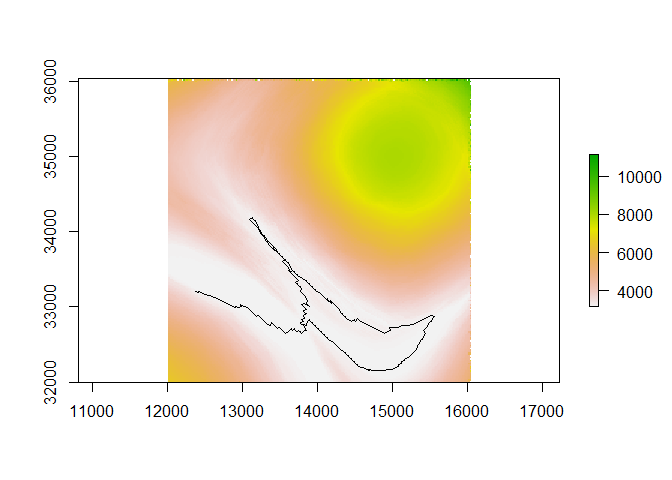

-   [lbmech](#lbmech)
    -   [Installation](#installation)
    -   [Example Workflow](#example-workflow)
        -   [Part 1: Topographic Data
            Sources](#part-1-topographic-data-sources)
        -   [Part 2: Velocity Data
            Sources](#part-2-velocity-data-sources)
        -   [Part 3: Preparing the World](#part-3-preparing-the-world)
        -   [Part 4: Getting Costs, Paths, and
            Corridors](#part-4-getting-costs-paths-and-corridors)
    -   [Quick Start](#quick-start)
        -   [For Energetic and Temporal Cost
            Calculations](#for-energetic-and-temporal-cost-calculations)
        -   [Custom Cost Functions and Multivariate
            Costs](#custom-cost-functions-and-multivariate-costs)

<!-- README.md is generated from README.Rmd. Please edit that file -->


# lbmech

<!-- badges: start -->
<!-- badges: end -->

`lbmech` is a geospatial package for least-cost path analysis in `R`. It
contains additional tools to calculate time- and energy-based
costs-of-travel for humans and animals moving across the landscape. The
general philosophy behind this package is that least-cost path analyses
should always be simple, the most time-taking parts should be done at
most once, and ideally that costs should be rooted in empirical reality.

In general terms, both `lbmech` and the deterministic functions of the
library `gdistance` provide similar capabilities but with notable
differences in computation and ease-of-use.`gdistance` stores movement
costs as their reciprocal (*conductance* ,
i.e. )
in a sparse matrix representing every possible transition between two
cells on a raster. The use of conductance allows for most cell-to-cell
transitions to be zero, since impossible transitions due to distance
have a conductance of
.
However, the use of conductance makes it cumbersome to employ functions
where f(0) != 0, requiring the use of index masking. This in turn
encounters integer overflow errors with ‘large’ datasets that are
nonetheless of a necessary size for most reasonable purposes.

`lbmech` stores data and performs all linear algebra directly on
resistance values using the `data.table` package. Not only is this more
intuitive, but it greatly simplifies the syntax necesary for many types
of algebraically simple operations. `lbmech` storrd each possible
movement as its own unique row, with entries for a `from` node, a `to`
node, and either the difference in or raw final and initial values of
the raster encountered during the transition. Nodes are named after the
coordinates of the raster cell to which they correspond, and are stored
as character strings in the form `'x,y'`. This allows for (1) in-place
modification of objects, greatly increasing processing speed; (2)
bidirectional raster analysis describing accumulated costs to and from a
node, and (3) additive, nonlinear, and multivariate transformations of
large rasters and independent considerations without running into
integer overflow limits. Since `lbmech` in the end is just a wrapper for
applying `data.table` and `igraph` functions to rasters, it’s easy to
generate any arbitrary cost function using `data.table` syntax.

To ensure that the most computationally intensive steps only need to be
performed once for many repeated analyses, `lbmech` also modularizes
important aspects of the cost-distance workflow. This allows for
ootherwise prohibitively-large spatial regions and fine spatial
resolutions to be considered. This is arguably necessary when land-based
transport requires decision-making to be made at scales on the order of
1-10 m. Files by default are stored in the temporary directory, however
if it’s expected that the particular procedure will be repeated again
after `R` is reinitialized it is *highly* recommended to designate a
consistent workspace directory in the `dir` parameter of most functions
for each time `makeWorld` (or a function that depends on it) is called
with new parameters. This ensures that each world only needs to be
generated *once*.

Finally, to encourage the use of least-cost analysis rooted in empirical
reality, `lbmech`’s default workflow is geared towards the study of
time- and energy- based considerations when moving across a landscape
(although the use of any cost function is possible as well). Unlike
similar tools such as `enerscape` for `R` in this regard, `lbmech`
allows for the estimation of various types of energetic losses (due to
kinematic locomotion, work against gravity, basal metabolic processes)
instead of simply the total energetic or metabolic expenditure.
Moreover, through the `getVelocity` function it provides a way of
deriving cost functions from GPS data of human and animal movement. This
is significantly less invasive than the VO<sub>2</sub> meters required
for direct estimation of net energetic expenditure.

The workflow demonstrated in this README provides a detailed guide for a
hypothetical analysis of least-cost energetic analysis employing the
examples included in the individual function documentation and
generating all data from scratch. For most purposes, only five or six
function calls to the package are necessary. A ‘quick start’ guide
summarizing the README example in as few function calls as possible is
provided at the end of this file. Please note that all units are in SI:
Kilograms for mass, meters for length, Joules for energy, seconds for
time.

## Installation

You can install the development version from
[GitHub](https://github.com/) with:

``` r
# install.packages("devtools")
devtools::install_github("andresgmejiar/lbmech")
```

## Example Workflow

``` r
library(lbmech)
# Set random seed for reproducibility's sake
set.seed(75291)
```

### Part 1: Topographic Data Sources

The first step in a typical `lbmech` workflow is defining the digital
elevation model (DEM) to define as the topographic data source. This may
be provided in one of two ways:

1.  A RasterLayer object representing the digital elevation model for
    the region-of-interest
    -   In order to ensure that there is a stable file path to the
        source DEM throughout the workflow, the raster must have been
        ‘read in’ using the `raster` function without having been
        further modified. If additional modifications are necessary, use
        the `writeRaster` function to save it to the disk first before
        re-reading it in using `raster`. For example:

``` r
# Generate a DEM
n <- 5
dem <- expand.grid(list(x = 1:(n * 100),
                        y = 1:(n * 100))) / 100
dem <- as.data.table(dem)
dem[, z := 250 * exp(-(x - n/2)^2) + 
      250 * exp(-(y - n/2)^2)]
dem <- rasterFromXYZ(dem)
extent(dem) <- c(10000, 20000, 30000, 40000)
crs(dem) <- "+proj=lcc +lat_1=48 +lat_2=33 +lon_0=-100 +datum=WGS84"

# Export it so it doesn't just exist on the memory
dir <- tempdir()
writeRaster(dem, paste0(dir,"/DEM.tif"),format="GTiff",overwrite=TRUE)


# Import raster
dem <- raster(paste0(dir,"/DEM.tif"))

plot(dem, main = "Digital Elevation Model")
```


1.  A SpatialPolygonsDataFrame object whose individual polygons
    represent sectors with unique DEM sources stored as a file path or
    URL in the data frame object. You can often find these from state
    agencies.
    -   As of the most recent version, `lbmech` supports file types
        readible by `rgdal` and `raster`, as well as such files
        compressed in `gz` and `zip` files–although the latter is likely
        to fail in Unix systems.

Even if you have already downloaded or imported a raster to use as a
topographic data source as in case one above, most of the functions will
expect a SpatialPolygonsDataFrame object in the form of case two. You
can make this using the `makeGrid` function:

``` r
grid <- makeGrid(dem = dem, nx = n, ny = n)

plot(dem, main = "Sectors to divide DEM")
plot(grid,add=TRUE)
```


`lbmech` is specifically designed to deal with **large** regions that
would be prohibitive to analyze if the data is stored exclusively within
the memory. To deal with this issue, `lbmech` will crop any input raster
into an `nx` by `ny` grid and save the sector in its own `gz` file for
case 1. In both cases—to save memory and computational time—sectors are
only cropped or downloaded on an as-needed basis. You can use the
`whichTiles` and `getMap` functions to identify which tile(s) might be
needed, and download or crop any such tiles that haven’t been prepared:

``` r
# Generate five random points that fall within the grid
points <- data.table(x = runif(5, extent(dem)[1], extent(dem)[2]),
                     y = runif(5, extent(dem)[3], extent(dem)[4]))
               
                           
# Run whichTiles and getMap to prepare appropriate sector files
tile_list <- whichTiles(region = points, polys = grid) 
#> Loading required namespace: rgeos
print(tile_list)
#> [1] "SECTOR_24" "SECTOR_9"  "SECTOR_25" "SECTOR_18" "SECTOR_20"

getMap(tiles = tile_list, polys = grid, dir = dir)
#> [1] "Cropping Tile SECTOR_24 (1 of 5)"
#> [1] "Cropping Tile SECTOR_9 (2 of 5)"
#> [1] "Cropping Tile SECTOR_25 (3 of 5)"
#> [1] "Cropping Tile SECTOR_18 (4 of 5)"
#> [1] "Cropping Tile SECTOR_20 (5 of 5)"
print(list.files(dir,recursive=TRUE, pattern = ".gz$"))
#> [1] "Elevations/SECTOR_18.gz" "Elevations/SECTOR_20.gz" "Elevations/SECTOR_24.gz" "Elevations/SECTOR_25.gz"
#> [5] "Elevations/SECTOR_9.gz"
```

By far the most computationally intensive part of the workflow is the
first transformation of the topographic data. To calculate the
distances, we will need to convert the data from a a matrix of locations
(a raster) with an associated attribute (elevation) to a list of
possible movements between locations (all raster cells and their
neighbors) and associated attribute (difference in elevation). These are
stored as `gz` files in a folder named `'Tensors'` in the workspace
directory and will be later read into the memory as required to avoid
having to re-calculate them every time they are needed:

``` r
# Select all tiles that exist between x = (12000,16000) and y = (32000,36000)
tiles <- extent(c(12000,16000,32000,36000))
tiles <- as(tiles,"SpatialPolygons")
crs(tiles) <- crs(grid)
tiles <- whichTiles(region = tiles, polys = grid)

makeWorld(tiles = tiles, polys = grid, cut_slope = 0.5, z_fix = dem, dir = dir)
#> [1] "Cropping Tile SECTOR_1 (1 of 9)"
#> [1] "Cropping Tile SECTOR_2 (2 of 9)"
#> [1] "Cropping Tile SECTOR_3 (3 of 9)"
#> [1] "Cropping Tile SECTOR_6 (4 of 9)"
#> [1] "Cropping Tile SECTOR_7 (5 of 9)"
#> [1] "Cropping Tile SECTOR_8 (6 of 9)"
#> [1] "Cropping Tile SECTOR_11 (7 of 9)"
#> [1] "Cropping Tile SECTOR_12 (8 of 9)"
#> [1] "Cropping Tile SECTOR_13 (9 of 9)"
#> [1] "Cropping Tile SECTOR_4 (1 of 2)"
#> [1] "Cropping Tile SECTOR_14 (2 of 2)"
#> [1] "Cropping Tile SECTOR_16 (1 of 2)"
#> [1] "Cropping Tile SECTOR_17 (2 of 2)"
#> [1] "Cropping Tile SECTOR_19 (1 of 1)"
```

`makeWorld` internally calls `getMap` so you do not need to prepare the
data beforehand. This, however, means that you will need to either erase
the created directories or define a new workspace directory and
regenerate all tensors from scratch if you later on wish to change any
of the parameters used in `makeWorld.`A note about the parameters. The
`cut_slope` is the magnitude of the dimensionless slope beyond which
movement is not possible.

`z_fix` merits special attention since its consistency will be required
for most of the later functions in the workflow.`lbmech` allows for
sector-defining grids pointing to DEM sources in different coordinate
reference systems, spatial resolutions, and grid origins. However, the
package requires a ‘master’ raster be designated that will define the
projection, spatial resolution, and grid origin to be used in the
analyses. All data will be projected to these ‘fixed’ parameters. Really
only the origin can be neglected from consideration, and generally to
minimize space should be left at its default of zero.

The spatial resolution should generally be of an order of magnitude
comparable to the scale of decision-making in a real-world environment.
For example, a 90 m SRTM raster cell would generally result in paths
much straighter than a real individual would walk, while a 0.10 cm would
result in paths much curlier than a real individual would walk. Thus,
for humans a reasonable resolution might be between 1-10 m, while for
ants it might be between 1-5 mm. If no `z_fix` is specified, the default
is a resolution of 5 m. If you wish to change this, you must make sure
to include the parameter `res = x` where `x` is desired resolution in
any function that requires `z_fix` or `proj` in the remainder of the
workflow.

The raster projection should be selected to minimize distance distortion
along different bearings—such as conformal projections. If your source
DEM is of the appropriate resolution and projection, you can simply use
the original DEM (or a constituent, if it’s multiple sources) as the
`z_fix` parameter throughout. If none of these rasters are appropriate,
you can make one using the `fix_z` function:

``` r
z_fix <- fix_z(proj   = crs(dem),         # Desired projection
               res    = res(dem),         # Desired resolution
               dx     = 0,                # Desired horizontal offset
               dy     = 0)                # Desired vertical offset
```

If you do not specify a `z_fix` parameter, the default is for the
functions to assign it as
`z_fix <- fix_z(proj = proj, res = 5, dx = 0, dy = 0)`. The functions
will generally try to figure out what the projection is, but it’s best
practice to define it outside of the function (ensuring it’s confromal
and in meters) and continually refer to it. In short, if a function has
a `z_fix` parameter, you must ALWAYS specify either a `z_fix` OR a
`crs`. If you modify both, `z_fix` takes precedence, and if you modify
either of them or `res`, `dx`, or `dy` when making the `world` for the
first time, you must modify them through the remainder of the workflow
CONSISTENTLY.

Contrary to my advice, in this example we will set `z_fix = dem` since
the resolution is low enough to minimize computational time.

### Part 2: Velocity Data Sources

The fundamental assumption behind the least-cost calculations is that
humans and animals tend to prefer to walk at predictable speeds at a
given slope. The maximum speed is generally achieved at one particular
slope, and speed would tend to decrease exponentially as the distance to
this ideal slope increases. Mathematically, this is described by
Tobler’s Hiking function

where  is
horizontal displacement,
 time,

horizontal speed,

the maximum walking speed,

the change in elevation versus the change in horizontal distance
(dimensionless slope, or

where 
is the slope in degrees or radians),
 the
ideal slope of maximum walking speed, and
 a parameter controling
how sensitive changes in speed are to changes in slope. Canonical
applications of this function to humans set

m/s,
,
and
}").

`lbmech` provides the getVelocity function by which these parameters can
be estimated from locational data for different species. Data should be
structured such that there is a column with x coordinates, a column with
y coordinates, a column with changes in time, and a column with a
trajectory id. Note that all values must be in meters (other than
`'dt'`, which must be in seconds), and the `'x'` and `'y'` coordinates
in a projected coordinate system. Alternatively, `'x'` and `'y'` may
represent the longitude and latitude, respectively, in decimal degrees
so long as `degs = TRUE`. If columns are named anything other than
`'x'`, `'y'`, `'dt'`, and `'id'`, the column names need to be declared
explicitly. Elevational data is provided as the `z` parameter. This can
be either a column with elevations—such as those recorded by a GPS
unit—a RasterLayer representing the DEM for that region, or a
SpatialPolygonsDataFrame like the output of the `makeGrid` function:

``` r
# Generate dummy GPS data
# 10,000 observations falling within the extent of the generted DEM
# taken at an interval of 120 seconds between observations
# and of 10 different individuals (1000 per individual)
data <- data.table(x = runif(10000,extent(dem)[1],extent(dem)[2]),
                   y = runif(10000,extent(dem)[3],extent(dem)[4]),
                   dt = 120,
                   ID = rep(1:10,each=1000))

velocity <- getVelocity(data = data, z = grid, dir = dir)
#> [1] "Cropping Tile SECTOR_23 (1 of 6)"
#> [1] "Cropping Tile SECTOR_21 (2 of 6)"
#> [1] "Cropping Tile SECTOR_10 (3 of 6)"
#> [1] "Cropping Tile SECTOR_22 (4 of 6)"
#> [1] "Cropping Tile SECTOR_15 (5 of 6)"
#> [1] "Cropping Tile SECTOR_5 (6 of 6)"
```

So what happened? `getVelocity` called `whichTiles` and `getMap` to
identify which tiles were needed to get the elevation for the points we
generated in `data`. It then cropped and saved each tile in a folder
named `'Elevations'` in the `dir`. Afterwards, it extracted the
elevation for each `data` point, and performed a nonlinear quantile
regression to get the appropriate parameters. Since GPS data can be
noisy, `getVelocity` also allows for `slope_lim` and `v_lim` parameters
to which dimensionless slope and velocity values are outliers before
performing the regression.

The output object is a list. Since this was calculated based on random
data, the calculated parameters here are meaningless but let’s have a
look at the structure anyways:

``` r
print(velocity)
```

    #> $model
    #> Nonlinear quantile regression
    #>    model:  dl_dt ~ v_max * exp(-k * abs(dz_dl - alpha)) 
    #>     data:  [ data (dl_dt <= v_lim) & abs(dz_dl) <= slope_lim 
    #>      tau:  0.95 
    #> deviance:  15513.54 
    #>             k         alpha 
    #>  9.3765158628 -0.0002554502 
    #> 
    #> $vmax
    #> [1] 94.47548
    #> 
    #> $alpha
    #> [1] -0.0002554502
    #> 
    #> $k
    #> [1] 9.376516
    #> 
    #> $tau_vmax
    #> [1] 0.995
    #> 
    #> $tau_nlrq
    #> [1] 0.95
    #> 
    #> $data
    #>        ID        x        y         z  dt         dx         dy         dz        dl     dl_dt        dz_dl
    #>     1:  1 12212.41 32529.50  91.27850 120         NA         NA         NA        NA        NA           NA
    #>     2:  1 11505.81 30739.54  14.78457 120  -706.5965 -1789.9575  -76.49393  1924.377 16.036474 -0.039749971
    #>     3:  1 15396.60 34388.33 468.68015 120  3890.7912  3648.7907  453.89558  5334.035 44.450292  0.085094225
    #>     4:  1 12964.58 32482.58 142.54257 120 -2432.0223 -1905.7497 -326.13757  3089.760 25.747996 -0.105554354
    #>     5:  1 10203.78 32573.76  58.64795 120 -2760.8021    91.1736  -83.89463  2762.307 23.019226 -0.030371216
    #>    ---                                                                                                     
    #>  9996: 10 11252.46 39152.06  10.87654 120 -7124.0611   832.2890  -19.38931  7172.514 59.770947 -0.002703279
    #>  9997: 10 18621.13 31766.48  27.82283 120  7368.6690 -7385.5834   16.94628 10432.839 86.940323  0.001624321
    #>  9998: 10 17874.49 32426.01  80.00574 120  -746.6408   659.5376   52.18292   996.224  8.301867  0.052380709
    #>  9999: 10 19379.55 33973.62 194.80910 120  1505.0552  1547.6026  114.80335  2158.765 17.989706  0.053180114
    #> 10000: 10 15913.79 36145.81 380.90640 120 -3465.7618  2172.1928  186.09731  4090.223 34.085194  0.045498080

The velocity list contains seven entries:

1.  `$model`, containing an object of class `nlrq` with the output model
    from the nonlinear quantile regression (nlrq) structured in the form
    of Tobler’s function. You can treat this as any other statistical
    model object such as `lm`.

2.  `$vmax`, containing the identified maximum velocity, calculated as
    the `tau_max` fraction of all observed velocities.

3.  `$alpha`, containing the identified angle of maximum velocity, and
    calculated from the nlrq of Tobler’s function

4.  `$k`, containing the identified topographic sensitivity factor, and
    calculated from the nlrq of Tobler’s function.

5.  `$tau_max`, containing the employed `tau_max`.

6.  `$tau_nlrq`, containing the employed `tau_nlrq`.

7.  `$data`, containing a data.table with the original data in a
    standardized format

Generally, the rate at which you are sampling locations should be
comparable to the amount of time you would expect it would take you to
travel from one cell to another. In this scenario, we can move up to
`contiguity = 2` pixels away so we want to move at `contiguity + 1`
pixels away. We expect to move at up to `v_est = 1.5` m/s, and each
pixel has a length of `\code{res(dem)} = 20`, so we should downsample
any signal that makes observations faster than
`t_step = res(dem) / v_est * (contiguity + 1) * sqrt(2)` seconds. If our
data is taken at a faster rate (for example, many phones record data at
an interval of 1-10 seconds), we can use the `downsample` function
before running the `getVelocity` function:

``` r
# Generate fake data with x,y coordinates, z elevation, and a t
# column representing the number of seconds into the observation
data2 <- data.table(x = runif(10000,10000,20000),
                   y = runif(10000,30000,40000),
                   z = runif(10000,0,200),
                   t = 1:1000,
                   ID = rep(1:10,each=1000))
                   
# Set the minimum value at 3 seconds
data2 <- downsample(data = data2, t_step = 3, z = 'z')
v2 <- getVelocity(data = data2)
```

Finally, we can also investigate the velocity function for various
sub-sets of the data. For example, let’s say that each ID represents a
unique individual, and we also have another column representing
different tracks followed by each individual:

``` r
# Generate fake data with x,y coordinates, z elevation, and a t
# column representing the number of seconds into the observation
data2 <- data.table(x = runif(10000,10000,20000),
                   y = runif(10000,30000,40000),
                   z = runif(10000,0,200),
                   dt = 15,
                   AnimalID = rep(1:10,each=1000),
                   TrackID = rep(1:100,each=100))
                   
# To get the velocity function for all observations togther
v1 <- getVelocity(data2, ID = 'TrackID')

# This is the same as above, but it only returns a list with the 
# coefficients and p-values
v2 <- dtVelocity(data2, ID = 'TrackID')

# Instead this function is best to get the coefficients for 
# each individual animal un a data.table using .SD
v3 <- data2[, dtVelocity(.SD, ID = 'TrackID'), 
            by = 'AnimalID', .SDcols = names(data2)]

head(v3)
#>    AnimalID        k         alpha    v_max          k_p      alpha_p
#> 1:        1  3.50000 -5.000000e-02 737.4180 9.114769e-03 1.730733e-02
#> 2:        2  3.50000 -5.000000e-02 727.9875 2.385765e-02 2.018783e-02
#> 3:        3  3.50000 -5.000000e-02 750.6535 3.684702e-02 5.935256e-02
#> 4:        4  3.50000 -5.000000e-02 739.6417 4.939626e-04 1.669016e-03
#> 5:        5 17.96599 -5.704558e-05 745.5354 0.000000e+00 9.383468e-01
#> 6:        6  3.50000 -5.000000e-02 733.1121 2.134099e-07 5.002490e-07
```

### Part 3: Preparing the World

You’ll have noticed that `makeWorld` simply made the `gz` files in the
working directory for each sector that’s required. To import them into
the memory, use the `importWorld` function. It first runs `makeWorld`
(which in turn calls `getMap`) to make sure each necessary sector has
been prepared, and then imports ONLY the possible movements falling
within a given `region` and excluding those falling within a given
`banned` area:

``` r
# Import the data lying between x = (12000,16000) and y = (32000,36000)...
region <- extent(c(12000,16000,32000,36000))
region <- as(region,"SpatialPolygons")
crs(region) <- crs(grid)

world <- importWorld(region = region, polys = grid, banned = NULL,
                     cut_slope = 0.5, z_fix = dem, dir = dir)
```

Let’s have a look at what the `world` data.table looks like:

``` r
head(world)
#>           from          to         dz
#> 1: 12010,34130 12030,34130  0.8184357
#> 2: 12010,34130 12010,34110 -1.7999878
#> 3: 12010,34130 12030,34110 -0.9815521
#> 4: 12010,34130 12050,34110 -0.1442108
#> 5: 12010,34130 12030,34090 -2.8067932
#> 6: 12030,34130 12010,34130 -0.8184357
```

There are three columns. `$from` and `$to` contain the x and y
coordinates for the start and stop of each possible movement/transition.
These are stored as character strings, with a precision of up to two
decimal points depending on the resolution and origin. `$dz` contains
the change in elevation encountered when traveling from the `$from` cell
to the `$to` cell.

The next step is calculating the cost in terms of time, work, and energy
for every possible transition. The `calculateCosts` function takes the
changes in elevation and using the velocity information from the
previous section, models of biomechanical work expenditure, and physical
limitations calculates the expected costs. There are currently three
available models, run `?calculateCosts` for more information on each
model and what parameters are required. This is for a 60 kg human with a
maximum walking speed of 1.5 m/s, a leg length of 80 cm, a stride length
of 1.6 m, a BMR of 93 J/s, and canonical values for Tobler’s hiking
function:

``` r
world <- calculateCosts(world = world, method = 'kuo', m = 60, v_max = 1.5,
                        BMR = 93, k = 3, alpha = -0.05, l_s = 1.6, L = 0.8)
```

Note that we could simply have done
`v_max = velocity$vmax, alpha = velocity$alpha, k = velocity$k`, but the
current `velocity` object was generated with random data and thus the
parameters are nonsensical. Taking a look at the `world` object now
shows an additional nine columns:

``` r
head(world)
#>           from          to         dz   x_i   y_i       dl     dl_t       dt     dU_l      dK_l      dW_l      dE_l
#> 1: 12010,34130 12030,34130  0.8184357 12010 34130 20.00000 1.141907 17.51456 481.7312  977.9639  7298.476  8927.330
#> 2: 12010,34130 12010,34110 -1.7999878 12010 34130 20.00000 1.330383 15.03326   0.0000 1327.4394  6637.197  8035.290
#> 3: 12010,34130 12030,34110 -0.9815521 12010 34130 28.28427 1.432720 19.74167   0.0000 2177.2016 10886.008 12721.983
#> 4: 12010,34130 12050,34110 -0.1442108 12010 34130 44.72136 1.303612 34.30572   0.0000 2849.9886 14249.943 17440.375
#> 5: 12010,34130 12030,34090 -2.8067932 12010 34130 44.72136 1.443657 30.97782   0.0000 3495.2198 17476.099 20357.037
#> 6: 12030,34130 12010,34130 -0.8184357 12030 34130 20.00000 1.459699 13.70145   0.0000 1598.0415  7990.208  9264.443
```

`$x_i` and `$y_i` give the numeric x and y coordinates of the first part
of the movement/transition. `$dl` gives the distance, `$dl_t` the
predicted speed, `$dt` the predicted amount of time spent making that
movement, `$dU_l` the work performed against gravity, `$dK_l` the
kinematic work performed, `$dW_l` the net mechanical work performed, and
`$dE_l` the total energetic/metabolic expenditure.

### Part 4: Getting Costs, Paths, and Corridors

The final part of the workflow involves calculating the minimum cost
and/or least-cost path between two sets of points. Generally the first
step in this process is running the `getCosts` function, with the
parameters set based on your needs:

1.  If you simply desire the distance between two sets of points (cases
    1 and 2), provide entries for `from` and `to` (or just `from` if the
    interest is in all distances between locations in that object).
    Output is a distance matrix. The computational time for this
    operation is comparable to generating a raster for the distance to
    all cells in the world (unless all of the locations in the object
    are close to each other). So unless the operation is to be done
    multiple times, it is highly recommended to generate the raster as
    below and extract values:

``` r
# Generate five random points that fall within the region
points <- data.table(ID = 1:5,
                     x = runif(5, extent(region)[1], extent(region)[2]),
                     y = runif(5, extent(region)[3], extent(region)[4]))
                     
# Get the cost for travel between all combination of points
costMatrix <- getCosts(world = world, from = points, z_fix = dem,
                       costs ='all', direction = 'out', dir = dir)
```

The output will be a list of cost matrices, with elements named after
the type of costand direction of travel:

``` r
print(costMatrix)
#> $time_out
#>        To_ID
#> From_ID        1        2        3        4        5
#>       1    0.000 3785.938 2568.529 2076.004 2310.362
#>       2 3050.684    0.000 1570.530 2929.603 1580.320
#>       3 1961.597 2038.679    0.000 3089.954 2039.565
#>       4 1945.193 3520.094 3380.561    0.000 1921.295
#>       5 1711.558 1684.172 1659.327 1423.330    0.000
#> 
#> $work_out
#>        To_ID
#> From_ID         1         2         3         4         5
#>       1       0.0 1692662.5 1083922.5  942510.9 1044711.7
#>       2 1202161.7       0.0  750423.6 1223106.8  721523.5
#>       3  927981.8  871342.2       0.0 1347879.8  865893.2
#>       4  861407.5 1592498.3 1456959.0       0.0  856901.6
#>       5  611075.4  774201.1  806600.5  569726.0       0.0
#> 
#> $energy_out
#>        To_ID
#> From_ID         1         2         3         4         5
#>       1       0.0 2052520.1 1322795.7 1139740.5 1259575.3
#>       2 1501162.6       0.0  908436.4 1502262.5  869120.5
#>       3 1131515.0 1060939.3       0.0 1651101.7 1058009.8
#>       4 1046297.7 1923020.9 1776951.6       0.0 1035582.0
#>       5  770250.3  930829.0  976948.6  702095.7       0.0
```

1.  If you wish to generate a RasterStack of costs from and/or to all
    nodes in the from object, set the `output = 'object'` and
    `destination = 'all'`.

2.  You may also save the rasters as a series of `tif` files in the same
    workspace directory as the transition `gz` tensor files and the
    cropped/downloaded DEMs. This allows us to use `getCosts` within a
    loop for large numbers of origin nodes without running into random
    access memory limitations. Do this by setting `output = 'file'` and
    `destination = 'all'`.

3.  You may perform (2) and (3) simultaneously by setting
    `output = c('file','object')` and `destination = 'all'`.

``` r
# Calculate the cost rasters to travel to and from a set of points
costRasters <- getCosts(world = world, from = points, z_fix = dem,
                        destination = 'all', costs = 'all',
                        output = c("object","file"), dir = dir)
```

Let’s take a look at the structure of the costRasters:

``` r
structure(costRasters)
#> $time_in
#> class      : RasterStack 
#> dimensions : 202, 202, 40804, 5  (nrow, ncol, ncell, nlayers)
#> resolution : 20, 20  (x, y)
#> extent     : 12000, 16040, 32000, 36040  (xmin, xmax, ymin, ymax)
#> crs        : +proj=lcc +lat_0=0 +lon_0=-100 +lat_1=48 +lat_2=33 +x_0=0 +y_0=0 +datum=WGS84 +units=m +no_defs 
#> names      :     To_1,     To_4,     To_5,     To_3,     To_2 
#> min values :        0,        0,        0,        0,        0 
#> max values : 3826.432, 4506.113, 3700.125, 3638.810, 4838.098 
#> 
#> 
#> $time_out
#> class      : RasterStack 
#> dimensions : 202, 202, 40804, 5  (nrow, ncol, ncell, nlayers)
#> resolution : 20, 20  (x, y)
#> extent     : 12000, 16040, 32000, 36040  (xmin, xmax, ymin, ymax)
#> crs        : +proj=lcc +lat_0=0 +lon_0=-100 +lat_1=48 +lat_2=33 +x_0=0 +y_0=0 +datum=WGS84 +units=m +no_defs 
#> names      :   From_1,   From_4,   From_5,   From_3,   From_2 
#> min values :        0,        0,        0,        0,        0 
#> max values : 4336.080, 4417.912, 2741.120, 3259.288, 3728.537 
#> 
#> 
#> $work_in
#> class      : RasterStack 
#> dimensions : 202, 202, 40804, 5  (nrow, ncol, ncell, nlayers)
#> resolution : 20, 20  (x, y)
#> extent     : 12000, 16040, 32000, 36040  (xmin, xmax, ymin, ymax)
#> crs        : +proj=lcc +lat_0=0 +lon_0=-100 +lat_1=48 +lat_2=33 +x_0=0 +y_0=0 +datum=WGS84 +units=m +no_defs 
#> names      :    To_1,    To_4,    To_5,    To_3,    To_2 
#> min values :       0,       0,       0,       0,       0 
#> max values : 1563957, 1958144, 1664177, 1550179, 2150581 
#> 
#> 
#> $work_out
#> class      : RasterStack 
#> dimensions : 202, 202, 40804, 5  (nrow, ncol, ncell, nlayers)
#> resolution : 20, 20  (x, y)
#> extent     : 12000, 16040, 32000, 36040  (xmin, xmax, ymin, ymax)
#> crs        : +proj=lcc +lat_0=0 +lon_0=-100 +lat_1=48 +lat_2=33 +x_0=0 +y_0=0 +datum=WGS84 +units=m +no_defs 
#> names      :  From_1,  From_4,  From_5,  From_3,  From_2 
#> min values :       0,       0,       0,       0,       0 
#> max values : 1916192, 1948730, 1219162, 1446797, 1460012 
#> 
#> 
#> $energy_in
#> class      : RasterStack 
#> dimensions : 202, 202, 40804, 5  (nrow, ncol, ncell, nlayers)
#> resolution : 20, 20  (x, y)
#> extent     : 12000, 16040, 32000, 36040  (xmin, xmax, ymin, ymax)
#> crs        : +proj=lcc +lat_0=0 +lon_0=-100 +lat_1=48 +lat_2=33 +x_0=0 +y_0=0 +datum=WGS84 +units=m +no_defs 
#> names      :    To_1,    To_4,    To_5,    To_3,    To_2 
#> min values :       0,       0,       0,       0,       0 
#> max values : 1928774, 2388734, 2008291, 1894229, 2602716 
#> 
#> 
#> $energy_out
#> class      : RasterStack 
#> dimensions : 202, 202, 40804, 5  (nrow, ncol, ncell, nlayers)
#> resolution : 20, 20  (x, y)
#> extent     : 12000, 16040, 32000, 36040  (xmin, xmax, ymin, ymax)
#> crs        : +proj=lcc +lat_0=0 +lon_0=-100 +lat_1=48 +lat_2=33 +x_0=0 +y_0=0 +datum=WGS84 +units=m +no_defs 
#> names      :  From_1,  From_4,  From_5,  From_3,  From_2 
#> min values :       0,       0,       0,       0,       0 
#> max values : 2326474, 2370636, 1489674, 1760632, 1821267
```

It’s a list of RasterStacks, each in a slot named after the type of cost
(time, work, or energy) and the direction of travel (out from a node, or
in to a node). Each RasterStack has one layer for each node, with the
value at each point in the RasterLayer representing the absolute minimum
cost necessary to travel between that given node to/from that given
point.

``` r
plot(costRasters$time_in[['To_5']],main='Time in Seconds to Travel to Point 5')
```

 Since
`'file'` was also listed in the `output` parameter for `getCosts`, the
raster files were also exported to a `'CostRasters'` folder in `dir`.

``` r
print(list.files(normalizePath(paste0(dir,"/CostRasters"))))
#>  [1] "Energy_From_1.tif" "Energy_From_2.tif" "Energy_From_3.tif" "Energy_From_4.tif" "Energy_From_5.tif"
#>  [6] "Energy_To_1.tif"   "Energy_To_2.tif"   "Energy_To_3.tif"   "Energy_To_4.tif"   "Energy_To_5.tif"  
#> [11] "Time_From_1.tif"   "Time_From_2.tif"   "Time_From_3.tif"   "Time_From_4.tif"   "Time_From_5.tif"  
#> [16] "Time_To_1.tif"     "Time_To_2.tif"     "Time_To_3.tif"     "Time_To_4.tif"     "Time_To_5.tif"    
#> [21] "Work_From_1.tif"   "Work_From_2.tif"   "Work_From_3.tif"   "Work_From_4.tif"   "Work_From_5.tif"  
#> [26] "Work_To_1.tif"     "Work_To_2.tif"     "Work_To_3.tif"     "Work_To_4.tif"     "Work_To_5.tif"
```

These rasters—be they stored as an object on the memory with
`'object' %in% output` or on the hard drive with `'file' %in% output'`
are required to compute cost corridors. For a given series of origins
and destinations (e.g. A -\> B -\> C) a cost raster gives the absolute
minimum expectedtotal cost that would be required to route the path
through any given point on the landscape. The cells with the lowest
value correspond to the least-cost path, while the value of all other
cells minus the lowest value represents the cost to perform a SINGLE
detour to any given location from the least-cost path. These rasters can
be generated with the `makeCorridor` function:

``` r
# Calculating the corridors from a list of RasterStacks,
# with path 1 -> 2 -> 4 -> 1 -> 5
pathOrder <- c(1,2,5,1,4)
corridors <- makeCorridor(rasters = dir, order = pathOrder)
plot(corridors$time - minValue(corridors$time), 
     main = 'Minimum detour in Seconds to add a given point on the
     landscape to the path 1 -> 2 -> 5 -> 1 -> 4')
```


We could also have used the parameter `rasters = costRasters` since
`makeCorridor` accepts the object output of `getCosts` as its input.
Note that the names of the nodes listed in `order` must correspond to
the names of the nodes used in the `from` column of the `getCosts`
function. Due to carried floats it is insufficient to simply select all
values corresponding to the minimum cost to identify the least-cost
path. Fortunately, the `getPaths` function can generate a list of
SpatialLinesDataFrame objects corresponding to the least-cost paths:

``` r
paths <- getPaths(world = world, nodes = points, z_fix = dem, order = pathOrder)

# re-plot the corridors
plot(corridors$time - minValue(corridors$time), 
     main = 'Least-Cost-Path for route 1 -> 2 -> 5 -> 1 -> 4')
plot(paths$time, add=TRUE)
```


## Quick Start

### For Energetic and Temporal Cost Calculations

Assuming that we have (1) generated a `dem`, (2) location `points`, (3)
high-resolution locational `data` representing the XY location of an
animal, and (4) a `region` of interest lying within the `dem`’s extent,
the minimum required workflow to get the velocity function, cost rasters
for a set of location points, a corridor between some or all of them,
and the least cost path is:

``` r
# Start by making the grid:
n <- 5
grid <- makeGrid(dem = dem, nx = n, ny = n)
# Or you can employ a grid from an alternate source pointing to
# filepaths or URLs from which to download data


# Get the velocity function
velocity <- getVelocity(data = data, z = grid, dir = dir)

# Calculate the transitional costs to move between each allowable cells.
# Replace the v_max, alpha, and k parameters with known values if appropriate,
# and make sure all other parameters are representative for your species of interest
world <- calculateCosts(world = grid, m = 60, v_max = velocity$vmax,
                        k = velocity$k, alpha = velocity$alpha, BMR = 93,
                        l_s = 1.6, L = 0.8, region = region, z_fix = dem,
                        cut_slope = 0.5, dir = dir)

# Get the total costs for the least-cost path between any point on the landscape
# and all of the nodes; export as rasters but don't keep the object
getCosts(world = world, from = points, z_fix = dem, destination = 'all',
         output = 'file', dir = dir)

# Calculate the corridors for the path between nodes 1 -> 2 -> 5 -> 1 -> 4
pathOrder <- c(1,2,5,1,4)
corridors <- makeCorridor(rasters = dir, order = pathOrder)

# Get that same least-cost path
paths <- getPaths(world = world, nodes = points, z_fix = dem, order = pathOrder)
```

### Custom Cost Functions and Multivariate Costs

It’s also possible to employ costs that aren’t directly a function of
the difference in elevation between two points. This could be because
the employed raster does not represent heights (such as a landcover
raster), or because the required values are the raw ones (not just the
difference). Neither case prohibits use of the workflow in Part 1. In
such situations, it’s important to bear in mind that `$dz` represents
that difference in value. When the raw values are needed, the `keep_z`
parameter in `makeWorld` should be a character vector including
`c('z_i','z_f')`, and also `dz` when the difference between them is
needed. If the raster is categorical (such as those representing
discrete landcover types), `dz` should be omitted. In the event of a tie
in mosaicing rasters, we’ll select the highest integer value
(`FUN = max`). Don’t forget to set `sampling = 'ngb'` if the data is
categorical and thus it’s inappropriate to employ the default
`'bilinear'` interpolation. If the origin x or y coordinates are needed,
the `xy1` parameter in `importWorld` should be set to `TRUE`, and
likewise for the destination coordinates and `xy2` parameter. If the
distance between the origin and destination are needed, `dl = TRUE`:

``` r
# Generate a categorical DEM
n <- 5
dem2 <- expand.grid(list(x = 1:(n * 100),
                        y = 1:(n * 100))) / 100
dem2 <- as.data.table(dem2)
dem2[, z := sample(1:4,size=nrow(dem2),replace=TRUE)]
dem2 <- rasterFromXYZ(dem2)
extent(dem2) <- c(10000, 20000, 30000, 40000)
crs(dem2) <- "+proj=lcc +lat_1=48 +lat_2=33 +lon_0=-100 +datum=WGS84"

# Export it so it doesn't just exist on the memory
dir2 <- normalizePath(paste0(tempdir(),"/Categorical"),mustWork=FALSE)
dir.create(dir2,showWarnings=FALSE)
writeRaster(dem2, paste0(dir2,"/DEM2.tif"),format="GTiff",overwrite=TRUE)

# Import raster, get the grid
dem2 <- raster(paste0(dir2,"/DEM2.tif"))
grid2 <- makeGrid(dem = dem2, nx = n, ny = n)

world2 <- importWorld(region = region, polys = grid2, cut_slope = Inf,
                      z_fix = dem, keep_z = c("z_i","z_f"), dl = TRUE, 
                      FUN = max, sampling = 'ngb', dir = dir2)
```

Let’s take a look at the structure of this new world data.table

``` r
head(world2)
#>           from          to z_i z_f       dl
#> 1: 12010,34130 12030,34130   3   4 20.00000
#> 2: 12010,34130 12010,34110   3   2 20.00000
#> 3: 12010,34130 12030,34110   3   3 28.28427
#> 4: 12010,34130 12050,34110   3   3 44.72136
#> 5: 12010,34130 12030,34090   3   2 44.72136
#> 6: 12030,34130 12010,34130   4   3 20.00000
```

Unlike the output of `importWorld` above, this contains five columns,
only sharing in common the `$from` and `$to` columns.Let’s pretend that
this raster represents landtypes, and for some reason travel between
cells of the same landcover type are prohibited. Bearing in mind that
since `distance = 16` a traveler could ‘hop’ over a single barrier cell,
we can still apply that condition using a simple data.table expression:

``` r
world2 <- world2[z_i != z_f, ]
```

This drops all entries where `z_i == z_f`. Now let’s calculate some
imaginary costs. Let’s say that the cost to travel from one landcover
type to another is square of the origin landcover class integer times
the destination class integer divided by the distance between the cells
`dl`:

``` r
world2[, fakeCost := z_i^2 * z_f / dl]
```

Since we’ve used the same `z_fix` and `precision` values, any
overlapping sections will have the same cell names as the example in
Part 3. Thus, we can calculate different types of costs based on
different types of landscape variables. For example, if the total cost
function we’re interested is the product of `$fakeCost` from above and
the gravitational potential energy `$dU_l` from part 3 we just need to
merge the `world` data.tables, calculate the total cost, and run
`getCosts`, `makeCorridor`, and `getPaths` as above but specifying the
new cost name.

``` r
# Merge the worlds
world3 <- merge(world[,.(from,to,dU_l)],           # Keep cell names
                world2[,.(from,to,fakeCost)],      # and costs, join
                by=c("from","to"), all=FALSE)      # on the latter two
                                                           

# Calculate our multivariate cost
world3[, newCost := fakeCost * dU_l]

# Get the total costs for the least-cost path between any point on the landscape
# and all of the nodes; export as rasters but don't keep the object
getCosts(world = world3, from = points, z_fix = dem, destination = 'all',
         output = 'file', costs='newCost', dir = dir2)

# Calculate the corridors for the path between nodes 1 -> 2 -> 5 -> 1 -> 4
pathOrder <- c(1,2,5,1,4)
corridors <- makeCorridor(rasters = dir2, order = pathOrder, cost='newCost')

# Get that same least-cost path
paths <- getPaths(world = world3, nodes = points, z_fix = dem, 
                  order = pathOrder, cost='newCost')
plot(corridors)
plot(paths,add=TRUE)
```


